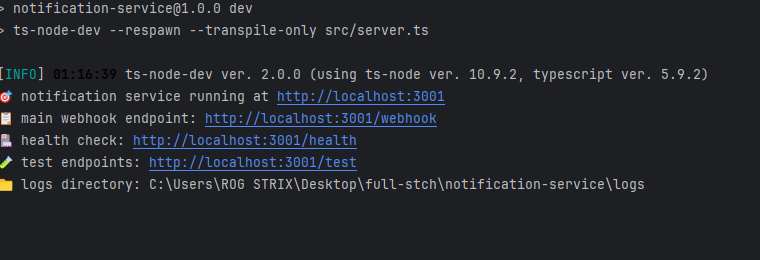

# CRON Management System

A complete CRON job management system with GraphQL backend, React frontend, and notification service.

##  Quick Start

### Prerequisites
- **Docker & Docker Compose** (recommended)
- **Node.js 18+** (for local development)
- **Redis** (for cluster mode - see local setup below)

- ---

## Alternative Implementation

This repository also includes a **NestJS-based implementation** available on the [`nestjs`](https://github.com/anasabbal/full-stch/tree/nestjs) branch.  

### Option 1: Docker (Recommended)
```bash
# Navigate to project root
cd full-stch

# Start all services
docker-compose up --build

# Or run in background
docker-compose up --build -d
```

### Option 2: Local Development

#### Step 1: Setup Redis (Required for Cluster Mode)
Choose one of the following methods:

**Using Docker:**
```bash
docker run -d --name redis-server -p 6379:6379 redis:alpine
```

**Using Package Managers:**
```bash
# macOS
brew install redis
brew services start redis

# Linux
sudo apt update && sudo apt install redis-server
sudo systemctl start redis-server

# Windows
choco install redis-64
redis-server
```
Backend

Frontend

Nootification Service

#### Step 2: Start Services
```bash
# Backend (terminal 1)
cd cron-backend
npm install
npm run dev                    # Runs on :4000
# Frontend (terminal 2)
cd cron-frontend
npm install
npm run dev                    # Runs on :3000
# Notification Service (terminal 3)
cd notification-service
npm install
npm run dev                    # Runs on :3001
```

###  Service URLs
| Service              | URL                                  | Description            |
|----------------------|--------------------------------------|------------------------|
| Frontend             | http://localhost:3000                | Web interface          |
| Backend API          | http://localhost:4000/graphql        | GraphQL playground     |
| Notification Service | http://localhost:3001                | Webhook receiver       |
| Health Check         | http://localhost:4000/health         | Service status         |
| Logs Viewer          | http://localhost:3001/logs           | Request history        |

##  Project Structure
```
full-stch/
├── docker-compose.yml         # multi-service setup
├── cron-backend/              # graphQL API & CRON engine
│   ├── src/
│   └── package.json
├── cron-frontend/             # react web interface
│   ├── src/
│   └── package.json
└── notification-service/      # webhook receiver
    ├── src/
    └── package.json
```

## 🎯 How to Use

1. **Create Your First CRON Job**
    - Open http://localhost:3000
    - Click "Create New Job"
    - Fill in the form:
        - **URI:** http://localhost:3001/webhook (local) or http://notification:3001/webhook (Docker)
        - **Method:** POST
        - **Schedule:** */5 * * * * (every 5 minutes)
        - **Body:** Hello from Anas!
        - **Timezone:** Your local timezone

2. **Monitor Execution**
    - **Job Status:** Check the main dashboard
    - **Logs:** Visit http://localhost:3001/logs
    - **Real-time Updates:** Frontend updates automatically

### Common CRON Schedules
| Schedule      | Description                |
|---------------|----------------------------|
| * * * * *     | Every minute               |
| */5 * * * *   | Every 5 minutes            |
| 0 9 * * *     | Daily at 9:00 AM            |
| 0 0 * * 0     | Weekly on Sunday midnight   |
| 0 0 1 * *     | Monthly on the 1st          |

## ️ Configuration

**Backend (.env):**
```env
NODE_ENV=development
PORT=4000
USE_CLUSTER=true  #false for single instance
REDIS_HOST=localhost
REDIS_PORT=6379
```

**Frontend (.env):**
```env
VITE_GRAPHQL_URL=http://localhost:4000/graphql
```

**Notification Service (.env):**
```env
PORT=3001
```

**Disable Cluster Mode:** Set `USE_CLUSTER=false` in backend `.env`.

##  Testing
```bash
# Test all services
cd cron-backend && npm test # if you see a lot of issues when you run tests it jut you are already have redis run on docker you need to shutdown it and make CLUSTER=false in the .env.test
cd cron-frontend && npm test
cd notification-service && npm test

# Or test individually
npm test
```

##  Stop Services
```bash
# Docker
docker-compose down

# Docker with volume cleanup
docker-compose down -v

# Local
Ctrl+C in each terminal
```

##  Features
-  Full CRUD Operations
-  Real-time Monitoring
-  Webhook Notifications
-  Timezone Support
-  Cluster Ready
-  Request Logging
-  GraphQL API
-  React Frontend
-  Docker Support

## 🔧 Troubleshooting

**Redis Connection Issues**
```bash
redis-cli ping
docker run -d --name redis-server -p 6379:6379 redis:alpine
```
Or set `USE_CLUSTER=false` in backend `.env`.


